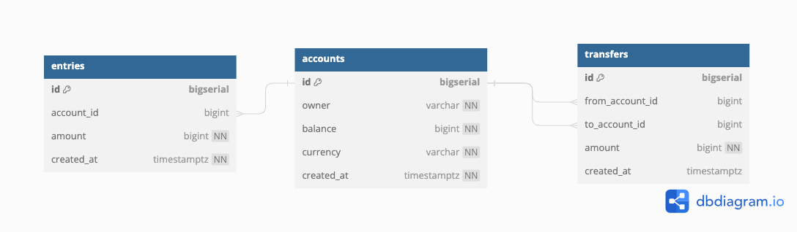

# DATABASE 

`docker pull postgres:alpine`

To start the postgres container 

`docker run --name postgres -p 5432:5432 -e POSTGRES_USER=root -e POSTGRES_PASSWORD=secret -d postgres:alpine`

Exec into the container 

`docker exec -it postgres psql -U root`

